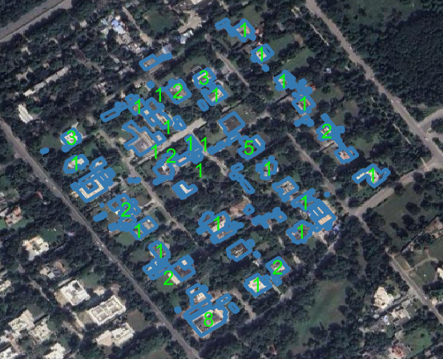

# Sustainability – Adaptation of Solar Energy

## Project Overview

This project aims to identify rooftop solar panels from satellite imagery and map them to residential house plots to analyze solar energy adoption within selected sectors of Chandigarh. A Detectron2-based deep learning model is used for solar panel detection, followed by geospatial analysis to estimate the panel locations and associate them with individual properties.

## Project Result

  

  <em>Solar Panel Detection and House-Level Mapping – Chandigarh Sector 4</em>

### Result Interpretation

- **Blue polygons** represent individual house boundaries.
- **Green labels** indicate the number of rooftop solar panels detected on each property.
- Only houses with one or more detected solar panels are labeled.
- Solar panel detections were converted from image coordinates to geographic coordinates and mapped to residential plots using GIS analysis.

This output demonstrates the complete end-to-end workflow, from satellite imagery collection and solar panel detection to geospatial mapping and house-level solar adoption analysis.

---

## Workflow

### Step 1: Area of Interest (AOI) Creation

Create polygons covering approximately 2 km² around three selected sectors in Chandigarh.

### Step 2: Satellite Imagery Collection

Scrape satellite imagery for the selected AOIs using a web-based imagery source with the tilt parameter set to **0°** to obtain top-down views.

### Step 3: Image Stitching

Combine all downloaded image tiles into seamless mosaics covering the complete AOIs.

### Step 4: Data Annotation

Manually label rooftop solar panels in the stitched imagery to prepare training data for Detectron2.

### Step 5: Model Training

Train a Detectron2 instance segmentation model using the annotated solar panel dataset.

### Step 6: Solar Panel Detection

Run inference on satellite imagery to identify and segment rooftop solar panels.

### Step 7: Geolocation Extraction

Convert the detected solar panel pixel coordinates into geographic coordinates (latitude and longitude). The centroid of each detected solar panel is used as the tentative panel location.

### Step 8: House Plot Association

Overlay the detected solar panel locations onto residential house plot polygons to identify properties equipped with solar panels.

## Inputs

### 1. Chandigarh AOI Shapefile

Contains polygon boundaries for the selected sectors used as the Area of Interest (AOI).

### 2. House Plot Dataset

Contains:

* Latitude and Longitude
* Plot Area (square meters)
* Geometry (Polygon)
* Confidence Score

## Technology Stack

* Python
* Detectron2
* OpenCV
* GeoPandas
* Shapely
* Rasterio
* NumPy
* Pandas
* Matplotlib

## Output

* Detected rooftop solar panels
* Latitude and longitude of detected panel centroids
* Solar panel to house-plot mapping
* Geospatial analysis of solar energy adoption within the selected Chandigarh sectors

## Applications

* Renewable energy adoption assessment
* Smart city planning
* Urban sustainability analysis
* Solar infrastructure mapping
* GIS-based decision support systems
